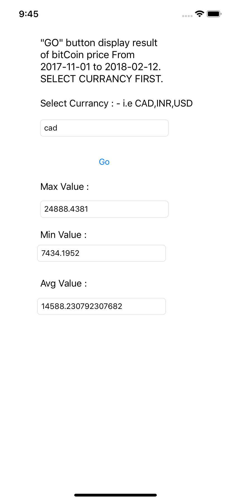

# bitCoin_IOS
Using Alamofire(Swift-based HTTP networking library) and swifyJSON (serialize JSON in swift object) to fetches bitCoin values for particular time period in different currencies.  

ScreenShot:-

// ------------------- Console Output 1 ------------------- //

// ------------------- Console Output 2 ------------------- //

// ------------------- Simulator Output ------------------- //

